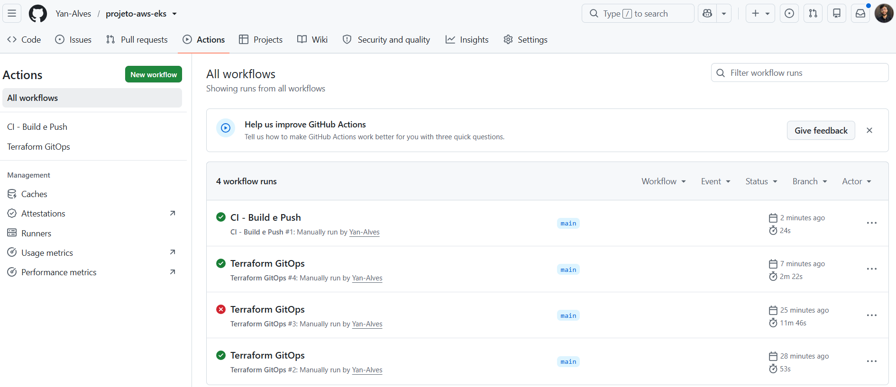
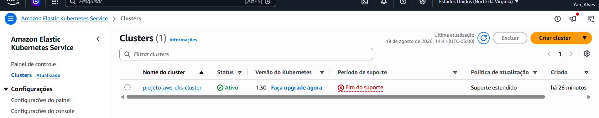
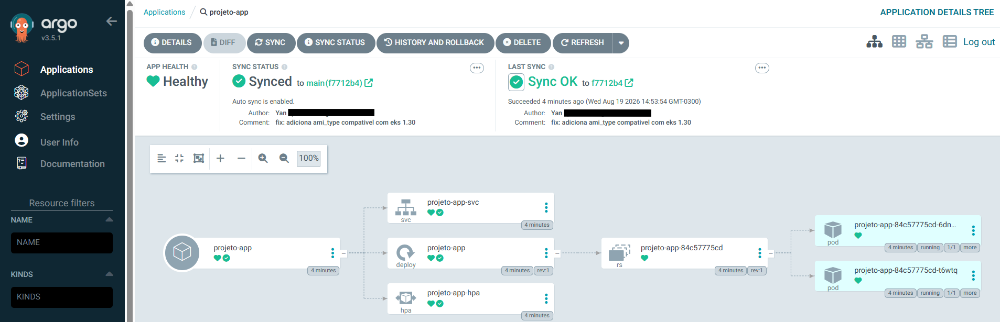
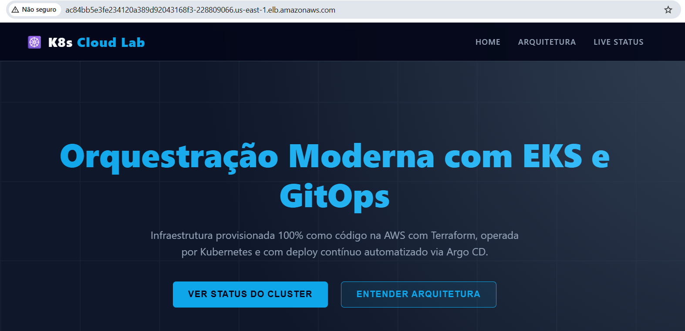
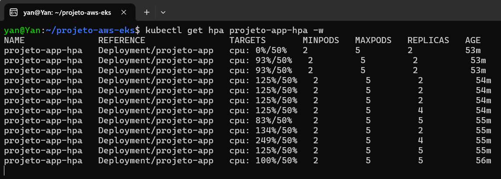
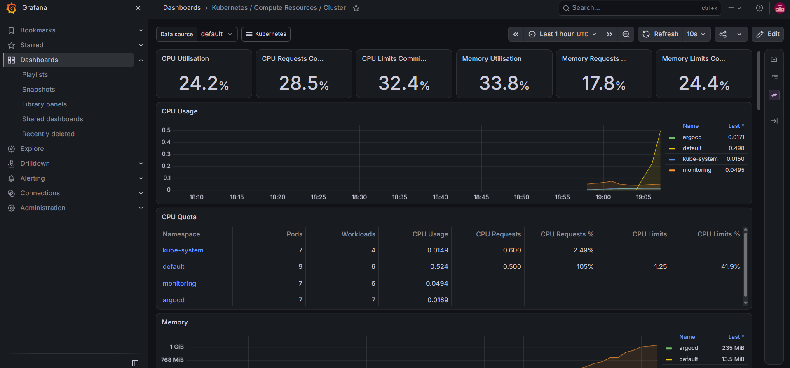

# Projeto de escalabilidade e GitOps: Automação Total com EKS, Argo CD e Prometheus

Eu montei esse projeto para trabalhar com um cenário real de orquestração avançada na nuvem. Usei o Terraform para provisionar toda a infraestrutura e o Argo CD para gerenciar as entregas contínuas. A minha ideia aqui foi pegar a base de rede e o site estático de [um projeto anterior meu](https://github.com/Yan-Alves/projeto-infra-escalavel-aws) e evoluir tudo para rodar dentro de um cluster Kubernetes gerenciado, utilizando o Amazon EKS e priorizando a automação e a resiliência. O processo é totalmente automatizado, desde a criação dos servidores até o deploy e o monitoramento.

Aqui com esse projeto eu quis usar uma aplicação como "cobaia" para realizar alguns testes para visualizar os limites da infraestrutura, da segurança e da observabilidade na prática.

### Meus objetivos com o projeto

*   **GitOps:** Busquei tirar a necessidade de ficar rodando o comando "kubectl apply" toda hora e coloquei o Argo CD dentro do cluster para vigiar meu repositório. Se eu mudo o manifesto no GitHub, o cluster se vira e atualiza sozinho.
*   **Auto Scaling:** Meu objetivo era forçar a infraestrutura a sofrer um pequeno "caos" de forma que ela se visse obrigada a escalar autonomamente. Se a demanda subir e a CPU estourar 50%, o cluster teria que criar mais réplicas do site pra dar conta do recado.
*   **Observabilidade:** Trouxe Prometheus e Grafana para ter uma visão de tudo, acompanhando em tempo real como o servidor físico lida com um ataque de tráfego na aplicação.
*   **Automação:** Todo o provisionamento do cluster, da rede e a construção das imagens Docker foram gerenciados por cliques nas esteiras do GitHub Actions. Zero comandos manuais na minha máquina local.

### Ferramentas que usei

*   **Terraform:** Para escrever e orquestrar toda a rede e o próprio cluster na AWS como código.
*   **Amazon EKS:** O serviço da AWS que escolhi para ser o motor principal da orquestração.
*   **Docker e AWS ECR:** Para empacotar a aplicação e criar um repositório seguro de imagens na nuvem.
*   **Argo CD:** A ferramenta responsável por garantir que o conceito de GitOps funcionasse corretamente.
*   **Prometheus e Grafana:** A stack de monitoramento para extrair métricas do cluster e gerar painéis gráficos.
*   **GitHub Actions:** Onde construí as pipelines para automatizar a infra e o build da imagem.

---

### Como a arquitetura funciona na prática

**1. A automação pelo GitHub Actions e o Troubleshooting**
Em vez de rodar o Terraform na minha máquina, joguei tudo pro GitHub. Criei fluxos separados para a rede e para o cluster EKS.

> A execução do "Terraform GitOps #3" falhou, mas a "#4" rodou com sucesso. Durante o provisionamento, a AWS barrou a criação dos Node Groups porque o EKS na versão 1.30 exigia a declaração explícita de um tipo de AMI compatível no código do Terraform. Analisei o erro nos logs do Actions, fui no código, adicionei a variável `ami_type` correta para os nodes, fiz o commit com a correção e rodei novamente, dessa vez funcionou e subiu o cluster perfeitamente.

**2. Cluster EKS**
Depois de corrigir o problema anterior, fui conferir se a AWS realmente entregou o que eu pedi via código.

> O painel oficial da AWS mostrando o projeto devidamente ativo e rodando na versão mais recente (1.30) do Kubernetes.

**3. O Fluxo GitOps com Argo CD**
Com o cluster funcionando, instalei o Argo CD e apontei ele pro meu repositório.

> O Argo CD leu meus manifestos YAML e criou os recursos de Service, Deployment e o HPA. O status verde de "healthy" e "synced" mostra que o que está no meu GitHub é o que está rodando lá no servidor da AWS.

**4. A Aplicação no ar**

> O site foi devidamente ao ar e consegui acessar ele com a URL pública gerada automaticamente pelo Application Load Balancer da AWS.

**5. Forçando o Auto Scaling sob estresse**
Para conseguir visualizar o Auto Scaling trabalhando, a ideia foi forçar um estresse que sobrecarregasse a CPU.

> Aqui eu monitoro via terminal a sobrecarga acontecendo, a ideia aqui era simular uma enorme quantidade de acessos simultâneos no nosso site. A CPU apresenta diversos picos dessa sobrecarga, e o cluster reage imediatamente escalando os pods de 2 para 4, até atingir o limite máximo que colocamos que seria 5. Tudo isso só para não deixar o site cair.

**6. Observabilidade em tempo real**
Subi o pacote do Prometheus com o Grafana no cluster para criar um painel de monitoramento e observar visualmente a sobrecarga.

> O dashboard do Grafana mostra em cor amarela o gráfico de CPU subindo exatamente na hora que forçamos a sobrecarga. A minha aplicação (que possui namespace 'default') chegou a atingir **105%** de CPU. Os medidores mostram que o uso de CPU global do nosso cluster EKS até que resistiu bem tranquilo e ficou em apenas **24.2%**. Ou seja, forçamos ao máximo uma sobrecarga no nosso site sem comprometer ou derrubar o servidor físico inteiro.

---

### O que tem no repositório

*   **`terraform/`**: Os códigos que criam a infra na AWS, divididos nas fases de rede e cluster EKS.
*   **`k8s/`**: Os manifestos YAML da aplicação (deployment, service e HPA) que o Argo CD fica vigiando.
*   **`.github/workflows/`**: A inteligência das esteiras automatizadas que aparecem lá na aba Actions do repositório.
*   **`app/`**: Os arquivos do site estático e o Dockerfile da nossa aplicação.
*   **`assets/`**: Onde guardei todos os prints do fluxo do projeto.